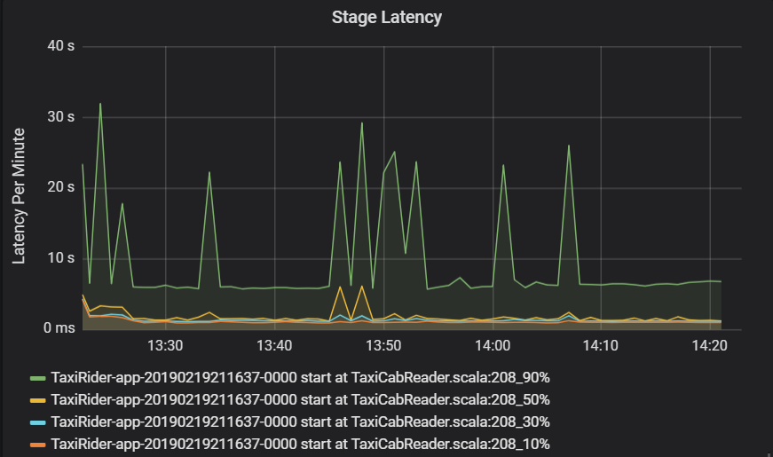
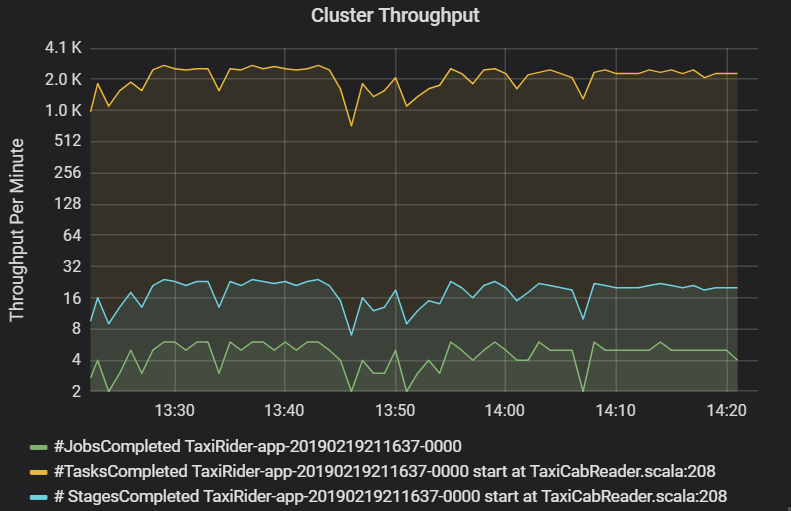
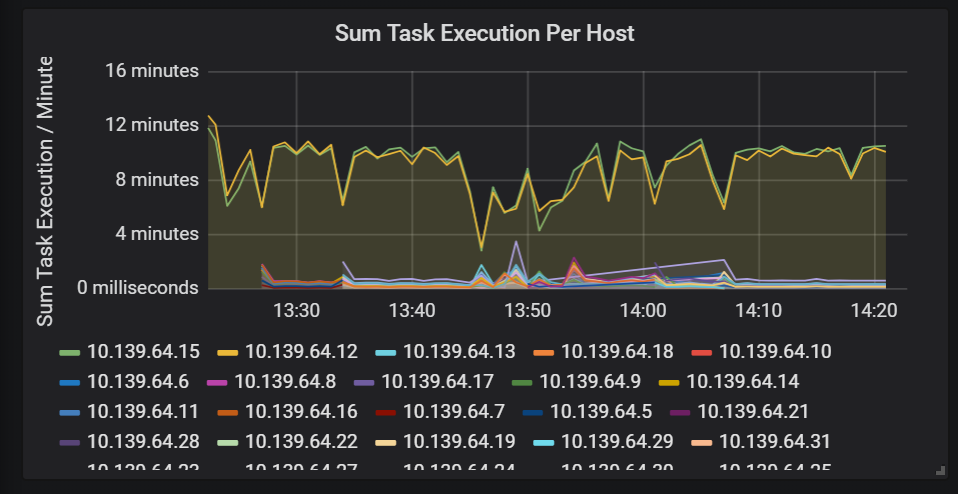
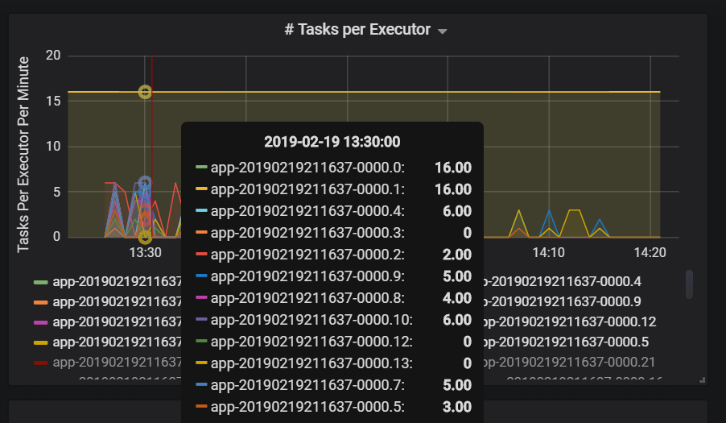
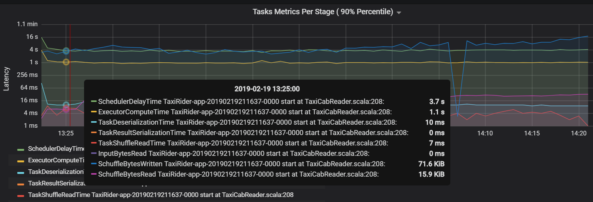
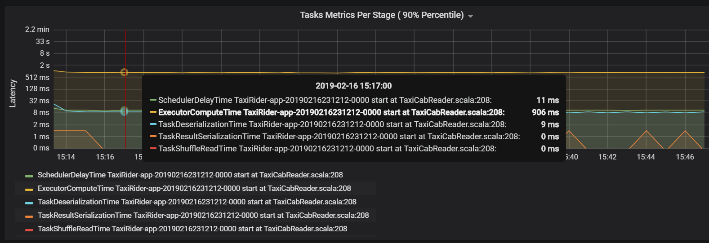

# Troubleshoot performance bottlenecks in Azure Databricks

[Azure Databricks](/azure/azure-databricks/) is a fast, powerful, and collaborative [Apache Spark](https://spark.apache.org/)–based analytics service that makes it easy to rapidly develop and deploy big data analytics and artificial intelligence (AI) solutions. Monitoring and troubleshooting performance issues is a critical component of operating your production Azure Databricks workloads, and the the final step in the process is to identify common performance issues using the monitoring visualizations based on telemetry data you've sent to your Log Analytics workspace and correct them in your application.

## Azure Databricks performance overview

Azure Databricks is based on Apache Spark, a general-purpose distributed computing system. Your application code, known as a **job**, executes on an Apache Spark cluster, coordinated by the cluster manager. In general, a job is the highest-level unit of computation.

A job represents the complete operation performed by your Apache Spark application from end-to-end. A typical operation includes reading data from a source, applying data transformations, and writing the results to storage or another destination. An important aspect of job performance is that the job advances through stages **sequentially**, which means that later stages are blocked by earlier ones.

Jobs are broken down into **stages** which represent , and stages further represent groups of identical **tasks** that can be executed in parallel on multiple nodes of the Spark cluster. Tasks are the most granular unit of execution taking place on a subset of the data.

To help identify and fix these common peformance issues, both the Azure Log Analytics and Grafana dashboards include a set of time-series visualizations. Each graph is time-series plot of metric data related to an Apache Spark [job](https://spark.apache.org/docs/latest/job-scheduling.html), stages of the job, and tasks that make up each stage.

This set of visualizations can be used to identify and troubleshoot the following common performance patterns:

## Task straggler

As mentioned earlier, stages in an application are executed sequentially with earlier stages blocking later stages. An Apache Spark task that executes a shuffle partition more slowly than other tasks will cause the whole cluster to run slowly because all tasks in the cluster must wait for the slow task to catch up before the stage can end. This can happen for the following reasons:

1. A node in the cluster experiences a underlying hardware problem such as connectivity or I/O issues. This can also be caused if the task scheduler inefficiently distributes tasks and overloads a particular node with more tasks than it can execute while other nodes are underutilized.
2. If a data aggregation operation is large, it may be difficult to split into an efficient number of tasks and may slow the overall completion of a stage.
3. In the case where partitions are of unequal size, a larger partition may cause unbalanced task execution.

### Job latency

Job latency is the duration of a job execution from when it starts (not when it was submitted) until it completes. It is shown as percentiles (10%, 30%, 50%, 90%) of a job execution per cluster and application ID, to allow the visualization of outliers. The following graph shows a job history where the 90% reached 50 seconds, whereas the median was much less.

Investigate job execution by cluster and application, looking for spikes in latency. Once clusters and applications with high latency are identified, move on to investigate stage latency.

### Stage latency

Stage latency is the next step to assess task straggler scenario. It is also shown in percentiles breakdown to allow the visualization of outliers. The visualization of stage latency is per cluster, application and stage name to allow the detection of a particular stage running slow. A job that is broken down in 4 stages if each stage runs slow it will affect the overall completion of a job. Identify spikes in task latency in the graph to determine which tasks are holding back completion of the stage.

In Cluster Throughput we provide a visualization for the number of jobs, stages, and tasks completed per minute. This helps you to understood the workload in terms of the relative number of stages and tasks per job.

### Sum of task execution latency

This visualization shows the sum of task execution latency per host running on a cluster. It allows to detect task straggler due to host slowing down on a cluster or a misallocation of tasks per executor for the auto scale scenario. In the following example, most of the hosts have a sum of about 30 seconds. However, two of the hosts have sums that hover around 10 minutes. Either the hosts are running slow or the numer of tasks per executor is misallocated.

By looking at the number of tasks per executor, we can see that two executors are assigned a disproportionate number of tasks, causing a bottleneck.

### Task metrics per stage

Task Metrics panel will give the breakdown of cost for a task execution. It also will produce the shuffle data size for a task. This will present opportunities for optimization around serialization, deserialization with implementation of broadcasts. Also it will produce a visualization of scheduler latency important for the Degree of Parallelization scenario discussed in the next use  case. Hover over the mouse on task metrics panel. Note the ExecutorComputeTime is the amount of time to run the task or if you wish task latency metrics discussed on previous topic. Ideally you do not want to see other times with a high ratio compared with ExecutorComputeTime. Those metrics can be understood as the cost for running a task( serialization, deserialization, scheduler delay time, shuffle read time, shuffle write time, jvm gc time) and the bytes that were shuffled to run the task. With this view of task metrics one can reliably understand where the cost is going for task running a particular stage.

The following graph shows the scheduler delay time exceeding the executor compute time. That means most tasks are waiting to run.

In this case, the problem was caused by having too many partitions, which caused a lot of overhead. Reducing the number of partitions lowered the scheduler delay time. Now most of the time is spent executing the task.

## Degree of Parallelism

During a structured streaming query, the assignment of a task to an executor is a resource intensive operation for the cluster. If the data under shuffle is not the optimal size, the amount of delay for a task will negatively impact throughput and latency. Another aspect is if there are too few partitions, the cores in the cluster will be underutilized and can also result in processing inefficiency. Conversely, if there are too many paritions, there is a great deal of management overhead for a small number of tasks.

To diagnose these problems, review the panels related to [cluster throughput](./dashboards.md#cluster-throughput), [job latency](./dashboards.md#job-latency), [streaming latency](./dashboards.md#streaming-throughputlatency), and scheduler delay time.

## Exceptions

The dashboard includes a panel that displays a time series sum of all exceptions. Identifying spikes in exceptions and their root causes will correct the performance issues they cause.