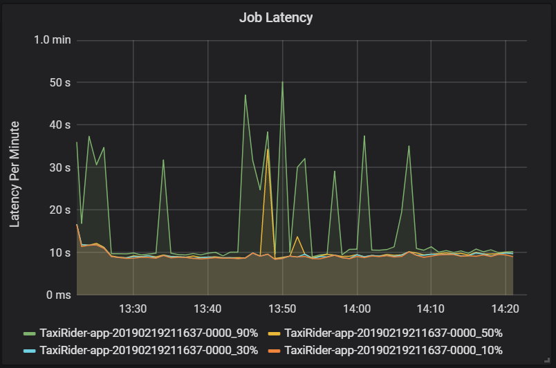

# Troubleshoot performance bottlenecks in Azure Databricks

[Azure Databricks](/azure/azure-databricks/) is a fast, powerful, and collaborative [Apache Spark](https://spark.apache.org/)–based analytics service that makes it easy to rapidly develop and deploy big data analytics and artificial intelligence (AI) solutions. Monitoring and troubleshooting performance issues is a critical component of operating your production Azure Databricks workloads, and the the final step in the process is to identify common performance issues using the monitoring visualizations based on telemetry data you've sent to your Log Analytics workspace and correct them in your application.

## Azure Databricks performance overview

Azure Databricks is based on Apache Spark, a general-purpose distributed computing system. Your application code, known as a **job**, executes on an Apache Spark cluster, coordinated by the cluster manager. In general, a job is the highest-level unit of computation.

A job represents the complete operation performed by your Apache Spark application from end-to-end. A typical operation includes reading data from a source, applying data transformations, and writing the results to storage or another destination. An important aspect of job performance is that the job advances through stages **sequentially**, which means that later stages are blocked by earlier ones.

Jobs are broken down into **stages** which represent , and stages further represent groups of identical **tasks** that can be executed in parallel on multiple nodes of the Spark cluster. Tasks are the most granular unit of execution taking place on a subset of the data.

To help identify and fix these common peformance issues, both the Azure Log Analytics and Grafana dashboards include a set of time-series visualizations. Each graph is time-series plot of metric data related to an Apache Spark [job](https://spark.apache.org/docs/latest/job-scheduling.html), stages of the job, and tasks that make up each stage.

This set of visualizations can be used to identify and troubleshoot the following common performance patterns:

## Task straggler

As mentioned earlier, stages in an application are executed sequentially with earlier stages blocking later stages. An Apache Spark task that executes a shuffle partition more slowly than other tasks will cause the whole cluster to run slowly because all tasks in the cluster must wait for the slow task to catch up before the stage can end. This can happen for the following reasons:

1. A node in the cluster experiences a underlying hardware problem such as connectivity or I/O issues. This can also be caused if the task scheduler inefficiently distributes tasks and overloads a particular node with more tasks than it can execute while other nodes are underutilized.
2. If a data aggregation operation is large, it may be difficult to split into an efficient number of tasks and may slow the overall completion of a stage.
3. In the case where partitions are of unequal size, a larger partition may cause unbalanced task execution.

Telemetry to watch:

**Job latency**. This metric is the duration of a job execution from when it starts (not when it was submitted) until it completes. It is shown as percentiles (10%, 30%, 50%, 90%) of a job execution per cluster and application ID, to allow the visualization of outliers. The following graph shows a job history where the 90% reached 50 seconds, whereas the median was much less.

Investigate job execution by cluster and application, looking for spikes in latency. Once clusters and applications with high latency are identified, move on to investigate stage latency.

| Visualization | Description |
|---------------|-------------|
| [Stage latency](./dashboards.md#stage-latency) | Select display of the clusters and applications identified above, then investigate to identify stages that have high latency and are blocking other stages. |
| [Task latency](./dashboards.md#task-latency) | Select display of the stages experiencing high latency identified above. Identify spikes in task latency in the graph to determine which tasks are holding back completion of the stage. |
| [Sum of Task Execution per host](./dashboards.md#sum-task-execution-per-host) | Select display of tasks with high latency identified in the task latency panel. Investigate spikes in the sum of task execution hosts to find the hosts that are stressed with a high number of tasks. This may be caused by inefficient task distribution by the executor.|
| [Task metrics](./dashboards.md#task-metrics) | These panels dispaly the breakdown of resource cost for a particular task execution. Investigating areas of excessive resource cost may identify opportunties for serialization and deserialization optimization. 
| [Streaming throughput/latency](./dashboards.md#streaming-throughputlatency) | For structured streaming queries, the number of input rows per second and the number of processed rows per second are the most important metrics for performance. Use this panel to identify tasks that have low streaming throughput and latency metrics. |
| [Resource consumption per executor](./dashboards.md#resource-consumption-per-executor) | Again, select tasks to find spikes in resource consumption that identify tasks that are running slowly and blocking the execution of other tasks.|

## Degree of Parallelism

During a structured streaming query, the assignment of a task to an executor is a resource intensive operation for the cluster. If the data under shuffle is not the optimal size, the amount of delay for a task will negatively impact throughput and latency. Another aspect is if there are too few partitions, the cores in the cluster will be underutilized and can also result in processing inefficiency. Conversely, if there are too many paritions, there is a great deal of management overhead for a small number of tasks.

To diagnose these problems, review the panels related to [cluster throughput](./dashboards.md#cluster-throughput), [job latency](./dashboards.md#job-latency), [streaming latency](./dashboards.md#streaming-throughputlatency), and scheduler delay time.

## Exceptions

The dashboard includes a panel that displays a time series sum of all exceptions. Identifying spikes in exceptions and their root causes will correct the performance issues they cause.